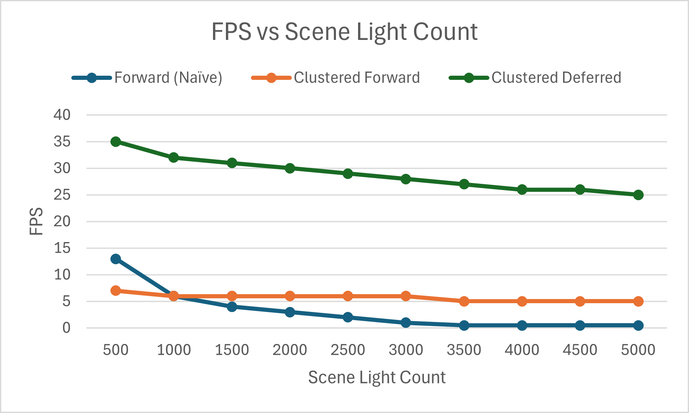
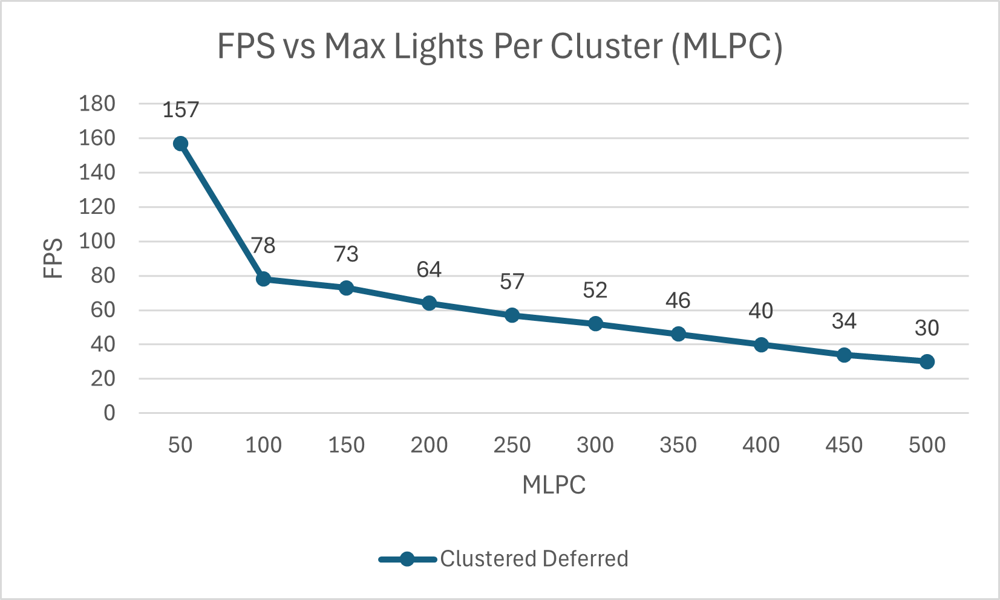

WebGPU Forward, Clustered Forward, and Clustered Deferred Rendering
======================

**University of Pennsylvania, CIS 5650: GPU Programming and Architecture, Project 4**

* Michael Rabbitz
  * [LinkedIn](https://www.linkedin.com/in/mike-rabbitz)
* Tested on: **Google Chrome 130.0** on Windows 10, i7-9750H @ 2.60GHz 32GB, RTX 2060 6GB (Personal)

## Live Demo
http://mrabbitz.github.io/Project4-WebGPU-Forward-Plus-and-Clustered-Deferred

**Your browser must support WebGPU** - check [here](https://webgpureport.org/)

**For a list of browsers and versions that do/don't support WebGPU** - check [here](https://caniuse.com/webgpu)

**You should also utilize your machine's high-performance GPU, if available**

## Demo GIF
**Note there is a loss of quality from GIF capture**

## Part 1: Introduction

This project explores multiple rendering techniques using WebGPU, focusing on how different methods handle varying numbers of lights, a key aspect of efficient scene rendering.
The goal is to compare and contrast the performance and implementation complexity of different approaches, particularly when scaling up the number of lights in a scene.

Three rendering methods are implemented:
- **Forward (Naive)**
- **Clustered Forward**
- **Clustered Deferred**

## Part 2: Rendering Methods Overview

### Forward Rendering (Naive)
Forward Rendering is the standard method that most rendering engines use.
In this pipeline, the GPU processes each object (or geometry) sequentially.
Each object is projected, broken down into vertices, and transformed into fragments (pixels).
These fragments are fully shaded and processed one at a time to produce the final image.

**Advantages:**
- **Simplicity:** Easy to implement and understand, ideal for simpler scenes.
- **Flexibility:** Supports diverse, high-quality shaders and effects for each object.

**Disadvantages:**
- **Overdraw:** Inefficient in scenes with overlapping objects, as it recalculates lighting for every fragment, wasting resources.
- **High Lighting Cost:** Requires lighting calculations for every fragment, leading to exponential computational costs as the number of lights increases.

### Clustered Forward Rendering
Clustered Forward Rendering improves the traditional forward method by organizing lights into 3D clusters based on their positions in view space.
This technique allows the GPU to efficiently determine which lights affect each fragment, significantly reducing the number of lighting calculations needed.

**Advantages:**
- **Efficient Light Management:** Reduces the number of lights processed per fragment, enhancing performance in complex scenes with many lights.
- **Scalability:** Handles increased light counts effectively, maintaining performance.

**Disadvantages:**
- **Complexity:** More complex to implement than naive forward rendering, requiring additional data structures and a compute shader for clustering.
- **Memory Overhead:** Introduces some memory overhead for storing cluster information.

### Clustered Deferred Rendering
Clustered Deferred Rendering combines the advantages of deferred rendering with clustered light management.
In this approach, geometry is processed in one pass to create a G-buffer, followed by a separate lighting pass that calculates lighting only for the relevant fragments.
This method optimizes rendering performance for scenes with many dynamic lights by minimizing overdraw and enabling efficient light calculations.

**Advantages:**
- **No Overdraw:** Calculates lighting only for visible pixels, processing each pixel once, regardless of object overlap.
- **Scalability:** Performance depends primarily on screen resolution and the number of lights rather than the object count.

**Disadvantages:**
- **High Memory Usage:** The G-buffer requires significant memory bandwidth, which can be a bottleneck for lower-end GPUs.
- **Limited Flexibility:** Challenges in handling effects like transparency or custom shading due to pre-defined G-buffer data.
- **Complex Shaders:** Requires an "uber shader" for the lighting pass, which can become complex and harder to manage.

## Part 3: Performance Analysis
**Terms**
- **Max Lights Per Cluster (MLPC):** Refers to the maximum number of lights that can be stored in each 3D cluster for Clustered rendering methods.
A higher MLPC allows for more lights per cluster but can increase the memory footprint and reduce performance.
- **Frames Per Second (FPS):** The primary metric used to measure performance in this section. FPS is measured using [stats.js](https://github.com/mrdoob/stats.js).
- **Loss of Quality (LOQ):** The degradation of visual quality in rendering, including inaccuracies in lighting and potential artifacts.

### 3.1: FPS vs Scene Light Count
**Section 3.1 fixed variables: MLPC of 512**

| Scene Light Count | Forward (Naive) FPS | Clusterd Forward FPS | Clustered Deferred FPS |
| ----------------- | ------------------- | -------------------- | ---------------------- |
| 500               | 13                  | 7                    | 35                     |
| 1,000             | 6                   | 6                    | 32                     |
| 1,500             | 4                   | 6                    | 31                     |
| 2,000             | 3                   | 6                    | 30                     |
| 2,500             | 2                   | 6                    | 29                     |
| 3,000             | 1                   | 6                    | 28                     |
| 3,500             | < 1                 | 5                    | 27                     |
| 4,000             | < 1                 | 5                    | 26                     |
| 4,500             | < 1                 | 5                    | 26                     |
| 5,000             | < 1                 | 5                    | 25                     |

**Analysis**

Forward rendering shows poor performance, struggling even at 500 lights and becoming unusable at higher counts, dipping below 1 FPS by 3,500 lights.
This makes Forward impractical for scenes with many dynamic lights.

Clustered Forward rendering demonstrates more stability, maintaining 5-7 FPS regardless of the light count, showcasing the benefits of spatial partitioning.
However, it still lags behind Clustered Deferred in overall performance.

Clustered Deferred rendering offers the best performance, with FPS declining gradually as light count increases.
Even at 5,000 lights, it sustains 25 FPS, making it the most suitable for scenes with many lights, where maintaining performance is critical.

### 3.2: FPS vs Max Lights Per Cluster (MLPC), with Loss of Quality (LOQ) Analysis
**Section 3.2 fixed variables: Scene Light Count of 2048**

| MLPC | Clustered Deferred FPS | LOQ - Lighting | LOQ - Tiling artifacts |
| ---- | ---------------------- | -------------- | ---------------------- |
| 50   | 157                    | Y              | Y                      |
| 100  | 78                     | Y              | Y                      |
| 150  | 73                     | Maybe          | Y                      |
| 200  | 64                     | N              | N                      |
| 250  | 57                     | N              | N                      |
| 300  | 52                     | N              | N                      |
| 350  | 46                     | N              | N                      |
| 400  | 40                     | N              | N                      |
| 450  | 34                     | N              | N                      |
| 500  | 30                     | N              | N                      |

**Analysis**

As MLPC increases, FPS decreases due to the added memory and computational load of handling more lights per cluster.
However, LOQ also decreases, with lighting inaccuracies and tiling artifacts reducing as MLPC rises.

At MLPC values below 10% of the scene light count, noticeable lighting inaccuracies and tiling artifacts occur.
At 50 MLPC, FPS is high, but visual quality is poor.

At and above 200 MLPC (about 10% of the scene light count), the LOQ stabilizes, indicating this is the point where the renderer can accurately handle the scene's lighting.
Don't take this as a hard rule, though, as different scenes may produce different results.
FPS declines steadily from 64 to 30 as MLPC increases from 200 to 500, reflecting the trade-off between performance and visual quality.

Takeaway 1: For static light counts, even with moving lights, tweaking the MLPC can help balance performance and quality.

Takeaway 2: In dynamic scenes, dynamic MLPC adjustment per rendering pass might offer improvements, though further testing is needed to determine the overhead.

## Running the code
Follow these steps to install and view the project:
- Clone this repository
- Download and install [Node.js](https://nodejs.org/en/)
- Run `npm install` in the root directory of this project to download and install dependencies
- Run `npm run dev`, which will open the project in your browser
  - The project will automatically reload when you edit any of the files

## References
- [WebGPU Samples - Deferred Rendering](https://webgpu.github.io/webgpu-samples/?sample=deferredRendering)

## Credits

- [Vite](https://vitejs.dev/)
- [loaders.gl](https://loaders.gl/)
- [dat.GUI](https://github.com/dataarts/dat.gui)
- [stats.js](https://github.com/mrdoob/stats.js)
- [wgpu-matrix](https://github.com/greggman/wgpu-matrix)
